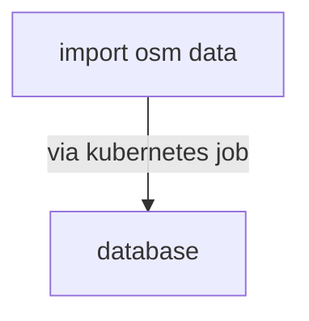

## Amenities

The project aims to show transportation and amenities on a regional basis, the goal is to assist making a decision on the best place to pick a house.

# City map

City maps and objects are loaded from open street map using osmnx package.

# architecture
